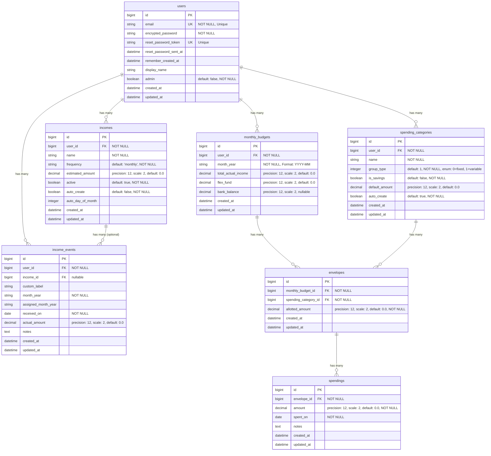

# Willow Database ER Diagram

This document contains the Entity-Relationship (ER) diagram for the Willow application database schema.

## Mermaid ER Diagram

## Relationship Details

### One-to-Many Relationships

1. **users → incomes** (1:N)
   - One user can have many income sources
   - Cascade delete: When a user is deleted, all their incomes are deleted

2. **users → income_events** (1:N)
   - One user can have many income events
   - Cascade delete: When a user is deleted, all their income events are deleted

3. **users → monthly_budgets** (1:N)
   - One user can have many monthly budgets (one per month)
   - Cascade delete: When a user is deleted, all their monthly budgets are deleted
   - Unique constraint: One budget per user per month (`user_id`, `month_year`)

4. **users → spending_categories** (1:N)
   - One user can have many spending categories
   - Cascade delete: When a user is deleted, all their spending categories are deleted
   - Unique constraint: One category name per user (`user_id`, `name`)

5. **incomes → income_events** (1:N, optional)
   - One income source can have many income events (tracking actual payments)
   - Optional relationship: Income events can exist without being linked to an income source
   - Cascade delete: When an income is deleted, all related income events are deleted

6. **monthly_budgets → envelopes** (1:N)
   - One monthly budget can have many envelopes (spending categories for that month)
   - Cascade delete: When a monthly budget is deleted, all its envelopes are deleted
   - Unique constraint: One envelope per spending category per budget (`monthly_budget_id`, `spending_category_id`)

7. **spending_categories → envelopes** (1:N)
   - One spending category can be used in many envelopes (across different monthly budgets)
   - Cascade delete: When a spending category is deleted, all related envelopes are deleted

8. **envelopes → spendings** (1:N)
   - One envelope can have many spending records (tracking individual transactions)
   - Cascade delete: When an envelope is deleted, all its spending records are deleted

## Unique Constraints

1. **users.email** - Unique email addresses
2. **users.reset_password_token** - Unique reset tokens
3. **incomes(user_id, name)** - Unique income name per user
4. **monthly_budgets(user_id, month_year)** - One budget per user per month
5. **spending_categories(user_id, name)** - Unique category name per user
6. **envelopes(monthly_budget_id, spending_category_id)** - One envelope per category per budget

## Calculated Fields (Not in Database)

These fields are calculated at the model level and are not stored in the database:

- **envelopes.spent_amount** - Calculated as `spendings.sum(:amount)` for that envelope
- **envelopes.name** - Delegated to `spending_category.name`
- **envelopes.spending_group_name** - Alias for `name` (backward compatibility)
- **envelopes.group_type** - Delegated to `spending_category.group_type`
- **envelopes.is_savings** - Delegated to `spending_category.is_savings`

## Notes

- All foreign keys use `on_delete: :cascade`, meaning child records are automatically deleted when parent records are deleted
- All tables include `created_at` and `updated_at` timestamps (managed by Rails)
- Decimal fields use `precision: 12, scale: 2` for currency values
- The `group_type` field in `spending_categories` is an enum: `0 = fixed`, `1 = variable`

---

**Last Updated**: December 2025

