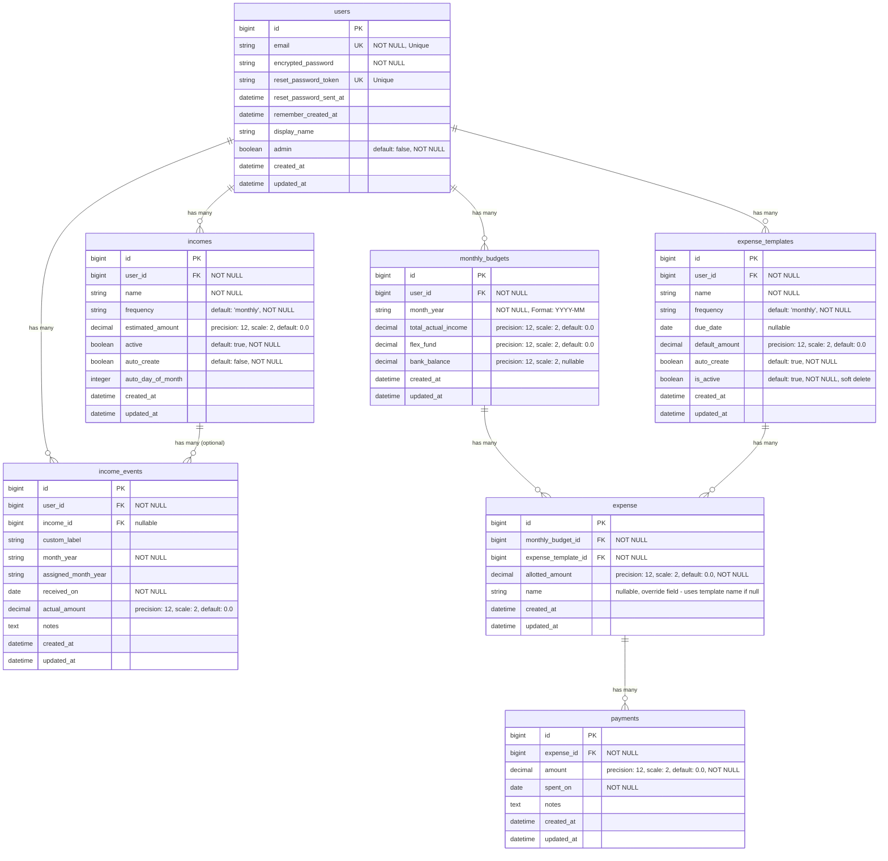

# Willow Database ER Diagram

This document contains the Entity-Relationship (ER) diagram for the Willow application database schema.

## Mermaid ER Diagram

## Relationship Details

### One-to-Many Relationships

1. **users → incomes** (1:N)
   - One user can have many income sources
   - Cascade delete: When a user is deleted, all their incomes are deleted

2. **users → income_events** (1:N)
   - One user can have many income events
   - Cascade delete: When a user is deleted, all their income events are deleted

3. **users → monthly_budgets** (1:N)
   - One user can have many monthly budgets (one per month)
   - Cascade delete: When a user is deleted, all their monthly budgets are deleted
   - Unique constraint: One budget per user per month (`user_id`, `month_year`)

4. **users → expense_templates** (1:N)
   - One user can have many expensetemplates (reusable templates for creating expense)
   - Cascade delete: When a user is deleted, all their expensetemplates are deleted
   - Unique constraint: One template name per user (`user_id`, `name`)

5. **incomes → income_events** (1:N, optional)
   - One income source can have many income events (tracking actual payments)
   - Optional relationship: Income events can exist without being linked to an income source
   - Cascade delete: When an income is deleted, all related income events are deleted

6. **monthly_budgets → expense** (1:N)
   - One monthly budget can have many expense (payment categories for that month)
   - Cascade delete: When a monthly budget is deleted, all its expense are deleted
   - Unique constraint: One expenseper template per budget (`monthly_budget_id`, `expense_template_id`), unless name override is used

7. **expense_templates → expense** (1:N)
   - One expensetemplate can be used in many expense (across different monthly budgets)
   - Templates provide default values (name, frequency, due_date, default_amount)
   - Expense can override template name on a per-month basis
   - Cascade delete: When an expensetemplate is deleted, all related expense are deleted

8. **expense → payments** (1:N)
   - One expensecan have many payment records (tracking individual transactions)
   - Cascade delete: When an expenseis deleted, all its payment records are deleted

## Unique Constraints

1. **users.email** - Unique email addresses
2. **users.reset_password_token** - Unique reset tokens
3. **incomes(user_id, name)** - Unique income name per user
4. **monthly_budgets(user_id, month_year)** - One budget per user per month
5. **expense_templates(user_id, name)** - Unique template name per user
6. **expense(monthly_budget_id, expense_template_id)** - One expenseper template per budget (unless name override is used)
7. **expense(monthly_budget_id, name)** - Unique name per budget when using name override

## Override Fields

Expense support override fields that allow customization per month:
- **name** (nullable): If set, overrides the template name for this expense

When override fields are `NULL`, the expense uses the values from its associated `expense_template`. Frequency and due_date always come from the template and cannot be overridden.

## Calculated Fields (Not in Database)

These fields are calculated at the model level and are not stored in the database:

- **expense.spent_amount** - Calculated as `payments.sum(:amount)` for that expense
- **expense.name** - Uses override if present, otherwise delegates to `expense_template.name`
- **expense.frequency** - Always delegates to `expense_template.frequency`
- **expense.due_date** - Always delegates to `expense_template.due_date`

## Notes

- All foreign keys use `on_delete: :cascade`, meaning child records are automatically deleted when parent records are deleted
- All tables include `created_at` and `updated_at` timestamps (managed by Rails)
- Decimal fields use `precision: 12, scale: 2` for currency values
- The `frequency` field in `expense_templates` can be: "monthly", "weekly", "biweekly", or "yearly"
- Expensetemplates serve as reusable templates for creating expense across multiple monthly budgets
- Expense can override template name to customize behavior for specific months

---

**Last Updated**: December 2025
