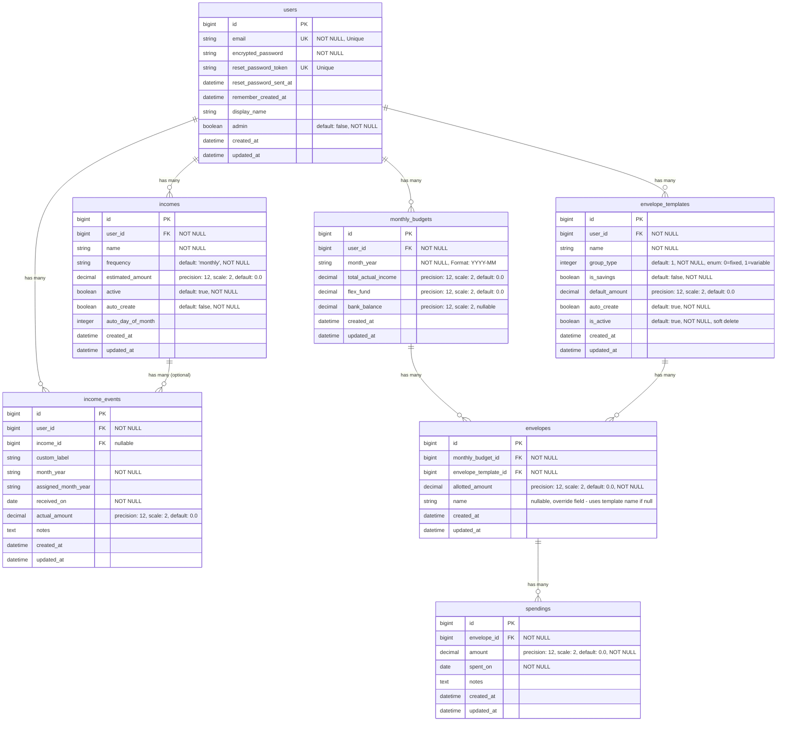

# Willow Database ER Diagram

This document contains the Entity-Relationship (ER) diagram for the Willow application database schema.

## Mermaid ER Diagram

## Relationship Details

### One-to-Many Relationships

1. **users → incomes** (1:N)
   - One user can have many income sources
   - Cascade delete: When a user is deleted, all their incomes are deleted

2. **users → income_events** (1:N)
   - One user can have many income events
   - Cascade delete: When a user is deleted, all their income events are deleted

3. **users → monthly_budgets** (1:N)
   - One user can have many monthly budgets (one per month)
   - Cascade delete: When a user is deleted, all their monthly budgets are deleted
   - Unique constraint: One budget per user per month (`user_id`, `month_year`)

4. **users → envelope_templates** (1:N)
   - One user can have many envelope templates (reusable templates for creating envelopes)
   - Cascade delete: When a user is deleted, all their envelope templates are deleted
   - Unique constraint: One template name per user (`user_id`, `name`)

5. **incomes → income_events** (1:N, optional)
   - One income source can have many income events (tracking actual payments)
   - Optional relationship: Income events can exist without being linked to an income source
   - Cascade delete: When an income is deleted, all related income events are deleted

6. **monthly_budgets → envelopes** (1:N)
   - One monthly budget can have many envelopes (spending categories for that month)
   - Cascade delete: When a monthly budget is deleted, all its envelopes are deleted
   - Unique constraint: One envelope per template per budget (`monthly_budget_id`, `envelope_template_id`), unless name override is used

7. **envelope_templates → envelopes** (1:N)
   - One envelope template can be used in many envelopes (across different monthly budgets)
   - Templates provide default values (name, group_type, is_savings, default_amount)
   - Envelopes can override template values (name, group_type, is_savings) on a per-month basis
   - Cascade delete: When an envelope template is deleted, all related envelopes are deleted

8. **envelopes → spendings** (1:N)
   - One envelope can have many spending records (tracking individual transactions)
   - Cascade delete: When an envelope is deleted, all its spending records are deleted

## Unique Constraints

1. **users.email** - Unique email addresses
2. **users.reset_password_token** - Unique reset tokens
3. **incomes(user_id, name)** - Unique income name per user
4. **monthly_budgets(user_id, month_year)** - One budget per user per month
5. **envelope_templates(user_id, name)** - Unique template name per user
6. **envelopes(monthly_budget_id, envelope_template_id)** - One envelope per template per budget (unless name override is used)
7. **envelopes(monthly_budget_id, name)** - Unique name per budget when using name override

## Override Fields

Envelopes support override fields that allow customization per month:
- **name** (nullable): If set, overrides the template name for this envelope
- **group_type** (nullable): If set, overrides the template group_type (fixed/variable) for this envelope
- **is_savings** (nullable): If set, overrides the template is_savings flag for this envelope

When override fields are `NULL`, the envelope uses the values from its associated `envelope_template`.

## Calculated Fields (Not in Database)

These fields are calculated at the model level and are not stored in the database:

- **envelopes.spent_amount** - Calculated as `spendings.sum(:amount)` for that envelope
- **envelopes.name** - Uses override if present, otherwise delegates to `envelope_template.name`
- **envelopes.spending_group_name** - Alias for `name` (backward compatibility)
- **envelopes.group_type** - Uses override if present, otherwise delegates to `envelope_template.group_type`
- **envelopes.is_savings** - Uses override if present, otherwise delegates to `envelope_template.is_savings`

## Notes

- All foreign keys use `on_delete: :cascade`, meaning child records are automatically deleted when parent records are deleted
- All tables include `created_at` and `updated_at` timestamps (managed by Rails)
- Decimal fields use `precision: 12, scale: 2` for currency values
- The `group_type` field in both `envelope_templates` and `envelopes` is an enum: `0 = fixed`, `1 = variable`
- Envelope templates serve as reusable templates for creating envelopes across multiple monthly budgets
- Envelopes can override template values to customize behavior for specific months

---

**Last Updated**: December 2025
